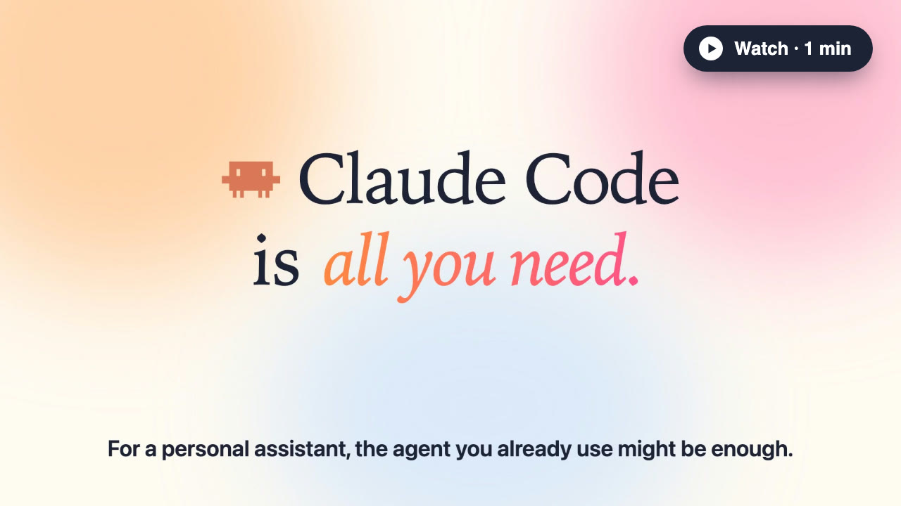

# Aide for Agents

**Turn your Claude Code or Codex into your personal assistant.**

It remembers you, keeps your goals moving, and briefs you every morning.

No new app · No account · Your data stays on your computer

[](https://with-yang.github.io/aide-for-agents/promo.mp4)

[Website](https://with-yang.github.io/aide-for-agents/) · [Watch the one-minute intro](https://with-yang.github.io/aide-for-agents/promo.mp4)

## Install

Ask Claude Code or Codex:

> Read `skill.md` in https://github.com/with-yang/aide-for-agents and install Aide for me.

Or clone this repository and ask your agent to read `skill.md`.

Then open a new session in `~/aide` and say hi. It gets to know you and your apps, and you wake up to a brief every morning. It never acts without your yes.

## What it does

- **What you promise in passing, it writes down.** "Sure, by Wednesday" in a chat becomes a todo.
- **Every morning, it tells you what matters today.** A short brief, with one-click actions. Quiet when there's nothing to say.
- **Before you meet someone, it reminds you where you left off.** Who they are, what they're waiting on, what you owe them.
- **It keeps the people around you in mind.** Birthdays, big moments, friends you've drifted from.

## Same agent. Now it knows you.

| | Bare agent | With Aide |
|---|---|---|
| "Prep me for my 10:00." | "Sure! What's the meeting about, and who's attending?" | "It's Jordan. He's waiting on your pricing feedback, and you still owe him the proposal. Draft the feedback first?" |
| Monday morning | Waits for you to ask. | "Launch week collides with Saturday's long run. Move it to Sunday?" |
| Switch to Codex | "I don't have access to your earlier conversations." | "Jordan's proposal by Wednesday, Chris's birthday Friday, your long run Saturday." |

## See exactly what it knows

Every memory is a file you can open, edit, and keep.

```markdown
memory/people/Jordan Lee.md
---
name: Jordan Lee
handles: [slack:@jordan, email:jordan@example.com]
tier: core
---

## What you told me          <- you wrote
Tell me right away when Jordan emails.

## What I've noticed         <- Aide wrote
Decides fast. Likes a short summary before a call.

## Log
- 09-28 · Chat · you promised the proposal by Wednesday
- 09-24 · Meeting · walked through pricing
```

The files live in `~/aide` on your computer, tracked in git. Claude Code and Codex read the same ones, so switching agents doesn't mean starting over.

## Works with the apps you already use

Gmail · Google Calendar · Slack · Notion · Obsidian · GitHub, and other apps your agent can connect to.

## Update

Your daily brief tells you when a new version is out; click update, or tell your assistant "update Aide". Your own files (profile, goals, memories, briefs) are never overwritten. What changed is in [CHANGELOG.md](CHANGELOG.md).

## Requirements

- Claude Code (the Claude desktop app is needed for the daily brief) or Codex
- macOS (other platforms untested)

Free and open source.
